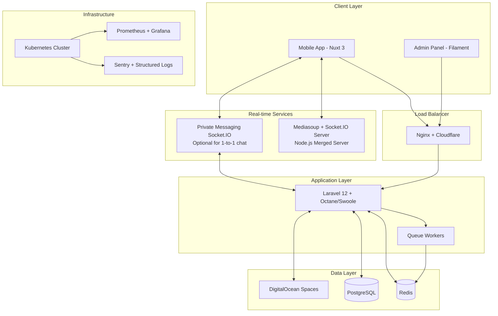
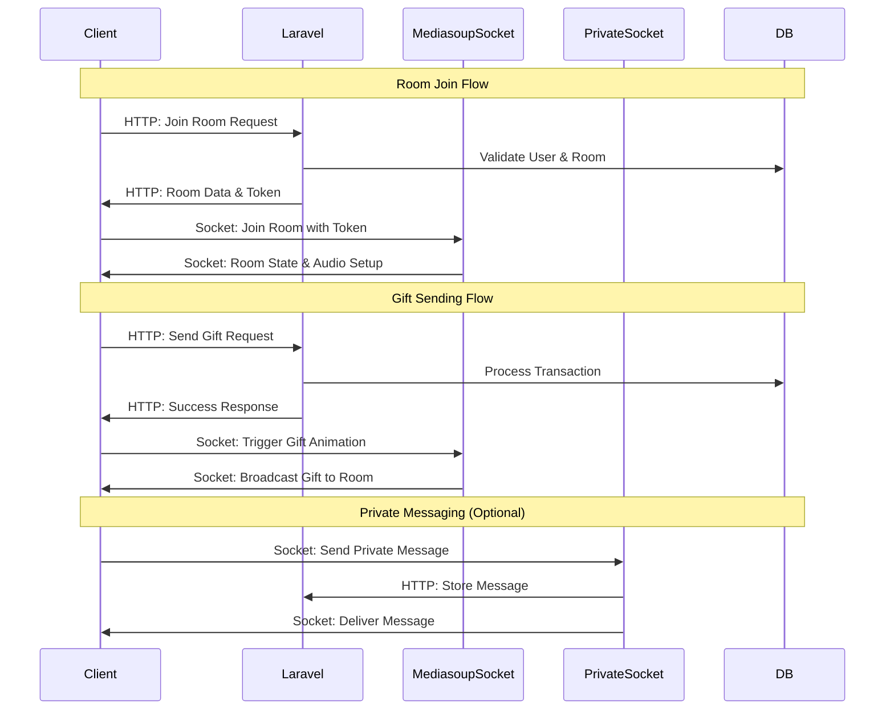

# Design Document

## Overview

The FlyLive backend rebuild will implement a modern, scalable architecture using Laravel 12 with a service-oriented design pattern. The system will handle real-time audio streaming coordination, comprehensive user management, room operations, coin economy, agency systems, and administrative functions. The architecture emphasizes performance, maintainability, and horizontal scalability to support 100,000+ concurrent users.

## Architecture

### High-Level Architecture



### Service Communication Pattern



## Components and Interfaces

### Core Service Layer

#### AuthenticationService
```php
interface AuthenticationServiceInterface
{
    public function registerUser(RegisterUserDTO $userData): AuthResult;
    public function authenticateUser(LoginCredentialsDTO $credentials): AuthResult;
    public function refreshToken(string $refreshToken): AuthResult;
    public function socialLogin(SocialLoginDTO $socialData): AuthResult;
    public function resetPassword(PasswordResetDTO $resetData): bool;
}
```

#### RoomService
```php
interface RoomServiceInterface
{
    public function createRoom(CreateRoomDTO $roomData): Room;
    public function getRoomWithToken(int $roomId, int $userId): RoomAccessResult;
    public function updateRoomSettings(int $roomId, RoomSettingsDTO $settings): Room;
    public function validateRoomAccess(int $roomId, int $userId): bool;
    public function updateRoomMetrics(int $roomId, RoomMetricsDTO $metrics): bool;
}
```

#### GiftingService
```php
interface GiftingServiceInterface
{
    public function sendGift(SendGiftDTO $giftData): GiftResult;
    public function calculateDistribution(Gift $gift, User $sender, User $recipient): DistributionResult;
    public function processGiftTransaction(GiftTransaction $transaction): TransactionResult;
}
```

#### CoinService
```php
interface CoinServiceInterface
{
    public function purchaseCoins(PurchaseCoinsDTO $purchaseData): TransactionResult;
    public function createCoinRequest(CoinRequestDTO $requestData): CoinRequest;
    public function processCoinRequest(int $requestId, ProcessRequestDTO $processData): bool;
    public function transferCoins(TransferCoinsDTO $transferData): TransactionResult;
}
```

### Repository Layer

#### UserRepository
```php
interface UserRepositoryInterface
{
    public function findByPhone(string $phone): ?User;
    public function findByEmail(string $email): ?User;
    public function findBySocialProvider(string $provider, string $providerId): ?User;
    public function createUser(array $userData): User;
    public function updateBalance(int $userId, float $amount, string $type): bool;
    public function getUserWithRelations(int $userId, array $relations): User;
}
```

#### RoomRepository
```php
interface RoomRepositoryInterface
{
    public function findActiveRooms(array $filters = []): Collection;
    public function findRoomWithParticipants(int $roomId): Room;
    public function updateRoomMetrics(int $roomId, array $metrics): bool;
    public function getRoomLeaderboards(string $period): Collection;
}
```

### Event System

#### Domain Events
```php
abstract class DomainEvent
{
    public readonly DateTime $occurredAt;
    public readonly string $eventId;
    
    public function __construct()
    {
        $this->occurredAt = new DateTime();
        $this->eventId = Str::uuid();
    }
}

class UserJoinedRoomEvent extends DomainEvent
{
    public function __construct(
        public readonly int $userId,
        public readonly int $roomId,
        public readonly DateTime $joinedAt
    ) {
        parent::__construct();
    }
}

class GiftSentEvent extends DomainEvent
{
    public function __construct(
        public readonly int $senderId,
        public readonly int $recipientId,
        public readonly int $giftId,
        public readonly float $amount,
        public readonly int $roomId
    ) {
        parent::__construct();
    }
}
```

### Real-time Integration Layer

#### Token Generation Service
```php
class RoomTokenService
{
    public function generateRoomToken(int $userId, int $roomId, array $permissions): string;
    public function validateRoomToken(string $token): TokenValidationResult;
    public function refreshRoomToken(string $token): string;
}
```

#### Real-time Event Broadcasting (Optional for Private Messages)
```php
class PrivateMessageService
{
    public function sendPrivateMessage(SendMessageDTO $messageData): MessageResult;
    public function getConversationHistory(int $userId1, int $userId2): Collection;
    public function markMessagesAsRead(int $conversationId, int $userId): bool;
}
```

#### Redis Event Publisher (For Internal Laravel Events)
```php
class RedisEventPublisher
{
    public function publishUserEvent(string $userId, array $eventData): void;
    public function publishSystemEvent(string $eventType, array $eventData): void;
    public function publishNotification(int $userId, array $notification): void;
}
```

## Data Models

### Core Entities

#### User Model Enhancement
```php
class User extends Authenticatable
{
    // Existing fields plus:
    protected $fillable = [
        // ... existing fields
        'wealth_level_id',
        'charm_level_id',
        'agency_id',
        'vip_level',
        'vip_expires_at',
        'total_spent',
        'total_received',
        'last_active_at'
    ];
    
    // Enhanced relationships
    public function agency(): BelongsTo;
    public function wealthLevel(): BelongsTo;
    public function charmLevel(): BelongsTo;
    public function activeRoom(): BelongsTo;
    public function ownedRoom(): HasOne;
    public function giftsSent(): HasMany;
    public function giftsReceived(): HasMany;
}
```

#### Enhanced Room Model
```php
class Room extends Model
{
    protected $fillable = [
        // ... existing fields
        'total_coins_spent',
        'daily_coins_spent',
        'weekly_coins_spent',
        'monthly_coins_spent',
        'participant_count',
        'max_participants',
        'room_level',
        'room_xp',
        'background_music_url',
        'is_featured'
    ];
    
    public function participants(): BelongsToMany;
    public function activeSeats(): HasMany;
    public function giftHistory(): HasMany;
    public function moderators(): BelongsToMany;
}
```

#### New Models

#### Agency Model
```php
class Agency extends Model
{
    protected $fillable = [
        'name',
        'description',
        'logo',
        'owner_id',
        'commission_rate',
        'member_limit',
        'total_earnings',
        'status'
    ];
    
    public function owner(): BelongsTo;
    public function members(): HasMany;
    public function earnings(): HasMany;
}
```

#### Gift Model Enhancement
```php
class Gift extends Model
{
    protected $fillable = [
        'name',
        'price',
        'category',
        'animation_url',
        'thumbnail_url',
        'rarity',
        'wealth_xp_multiplier',
        'charm_xp_multiplier',
        'is_active'
    ];
    
    public function transactions(): HasMany;
}
```

#### Level System Models
```php
class Level extends Model
{
    protected $fillable = [
        'name',
        'type', // wealth, charm, room, vip
        'required_xp',
        'level_number',
        'rewards',
        'privileges'
    ];
    
    protected $casts = [
        'rewards' => 'array',
        'privileges' => 'array'
    ];
}

class UserLevel extends Model
{
    protected $fillable = [
        'user_id',
        'level_id',
        'current_xp',
        'achieved_at',
        'is_active'
    ];
}
```

### Database Schema Enhancements

#### Enhanced Users Table
```sql
ALTER TABLE users ADD COLUMN wealth_level_id BIGINT REFERENCES levels(id);
ALTER TABLE users ADD COLUMN charm_level_id BIGINT REFERENCES levels(id);
ALTER TABLE users ADD COLUMN agency_id BIGINT REFERENCES agencies(id);
ALTER TABLE users ADD COLUMN vip_level INTEGER DEFAULT 0;
ALTER TABLE users ADD COLUMN vip_expires_at TIMESTAMP NULL;
ALTER TABLE users ADD COLUMN total_spent DECIMAL(15,2) DEFAULT 0;
ALTER TABLE users ADD COLUMN total_received DECIMAL(15,2) DEFAULT 0;
ALTER TABLE users ADD COLUMN last_active_at TIMESTAMP NULL;
```

#### New Tables
```sql
CREATE TABLE agencies (
    id BIGSERIAL PRIMARY KEY,
    name VARCHAR(100) NOT NULL,
    description TEXT,
    logo TEXT,
    owner_id BIGINT REFERENCES users(id),
    commission_rate DECIMAL(5,2) DEFAULT 10.00,
    member_limit INTEGER DEFAULT 50,
    total_earnings DECIMAL(15,2) DEFAULT 0,
    status VARCHAR(20) DEFAULT 'active',
    created_at TIMESTAMP DEFAULT NOW(),
    updated_at TIMESTAMP DEFAULT NOW()
);

CREATE TABLE room_participants (
    id BIGSERIAL PRIMARY KEY,
    room_id BIGINT REFERENCES rooms(id),
    user_id BIGINT REFERENCES users(id),
    joined_at TIMESTAMP DEFAULT NOW(),
    left_at TIMESTAMP NULL,
    is_active BOOLEAN DEFAULT true,
    role VARCHAR(20) DEFAULT 'participant' -- participant, moderator, speaker
);

CREATE TABLE gift_transactions (
    id BIGSERIAL PRIMARY KEY,
    sender_id BIGINT REFERENCES users(id),
    recipient_id BIGINT REFERENCES users(id),
    gift_id BIGINT REFERENCES gifts(id),
    room_id BIGINT REFERENCES rooms(id),
    quantity INTEGER DEFAULT 1,
    total_cost DECIMAL(10,2),
    recipient_earnings DECIMAL(10,2),
    agency_commission DECIMAL(10,2),
    sent_at TIMESTAMP DEFAULT NOW()
);
```

## Error Handling

### Standardized Error Response Format
```php
class ApiResponse
{
    public static function success($data = null, string $message = 'Success', int $code = 200): JsonResponse
    {
        return response()->json([
            'success' => true,
            'message' => $message,
            'data' => $data,
            'timestamp' => now()->toISOString()
        ], $code);
    }
    
    public static function error(string $message, int $code = 400, $errors = null): JsonResponse
    {
        return response()->json([
            'success' => false,
            'message' => $message,
            'errors' => $errors,
            'timestamp' => now()->toISOString()
        ], $code);
    }
}
```

### Custom Exception Classes
```php
class InsufficientFundsException extends Exception
{
    public function __construct(float $required, float $available)
    {
        parent::__construct("Insufficient funds. Required: {$required}, Available: {$available}");
    }
}

class RoomCapacityExceededException extends Exception
{
    public function __construct(int $roomId, int $maxCapacity)
    {
        parent::__construct("Room {$roomId} has reached maximum capacity of {$maxCapacity}");
    }
}

class UnauthorizedRoomActionException extends Exception
{
    public function __construct(string $action, int $roomId)
    {
        parent::__construct("Unauthorized to perform {$action} in room {$roomId}");
    }
}
```

## Testing Strategy

### Test Architecture
```
tests/
├── Unit/
│   ├── Services/
│   ├── Repositories/
│   ├── Models/
│   └── Helpers/
├── Feature/
│   ├── Api/
│   ├── Auth/
│   ├── Rooms/
│   ├── Gifting/
│   └── Admin/
├── Integration/
│   ├── Redis/
│   ├── Database/
│   └── ExternalServices/
└── Performance/
    ├── LoadTesting/
    └── StressTesting/
```

### Testing Patterns

#### Service Testing
```php
class GiftingServiceTest extends TestCase
{
    public function test_gift_sending_deducts_correct_amount()
    {
        // Arrange
        $sender = User::factory()->create(['coin_balance' => 1000]);
        $recipient = User::factory()->create();
        $gift = Gift::factory()->create(['price' => 100]);
        
        // Act
        $result = $this->giftingService->sendGift(new SendGiftDTO(
            senderId: $sender->id,
            recipientId: $recipient->id,
            giftId: $gift->id,
            quantity: 2
        ));
        
        // Assert
        $this->assertTrue($result->success);
        $this->assertEquals(800, $sender->fresh()->coin_balance);
    }
}
```

#### Integration Testing
```php
class RoomIntegrationTest extends TestCase
{
    public function test_room_join_publishes_redis_event()
    {
        // Arrange
        Redis::shouldReceive('publish')
            ->once()
            ->with('room.1.events', Mockery::type('string'));
        
        // Act
        $this->roomService->joinRoom(1, $this->user->id);
        
        // Assert - Redis mock expectations verified
    }
}
```

### Performance Testing Strategy

#### Load Testing Scenarios
1. **Concurrent Room Joins**: 1000 users joining rooms simultaneously
2. **Gift Sending Burst**: 500 gifts sent within 10 seconds
3. **Chat Message Flood**: 100 messages per second in active rooms
4. **API Endpoint Stress**: 10,000 requests per minute to critical endpoints

#### Performance Benchmarks
- API Response Time: < 200ms for 95th percentile
- Database Query Time: < 50ms average
- Redis Operations: < 10ms average
- Memory Usage: < 512MB per Octane worker
- CPU Usage: < 70% under normal load

This design provides a robust, scalable foundation for the FlyLive platform rebuild, emphasizing clean architecture, comprehensive testing, and performance optimization.